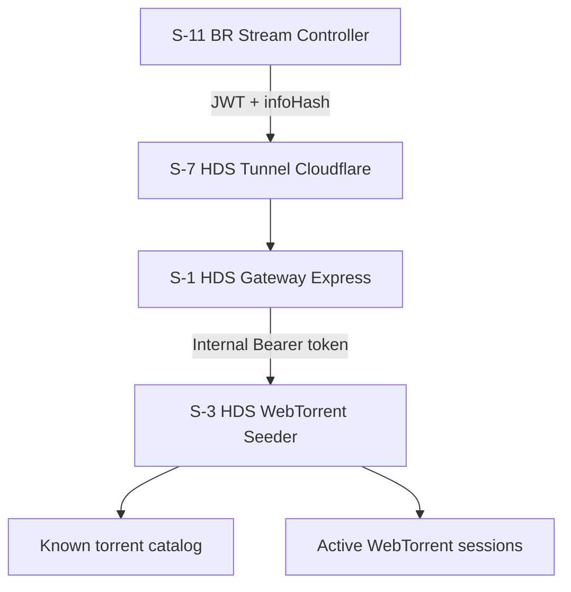

# ADR-005 — Gateway Architecture

Title: Gateway Architecture and Command Layer

Version: 0.9

Status: Check

Progress: In Progress

GitHub: Published

Owner: SoNexus Project

Last Updated: 2026-08-07

---

# Context

SoNexus requires a protected control path that can activate HDS WebTorrent bootstrap seeding for one known album without turning the Gateway into an audio proxy or accepting arbitrary torrent sources.

The published implementation currently exposes read-only Gateway and Seeder APIs. It does not implement the Command Layer defined by this ADR.

---

# Decision

S-1 HDS Gateway Express owns request validation, client authentication, rate limiting, error normalization and orchestration.

S-3 HDS WebTorrent Seeder owns the catalog of known torrents, WebTorrent sessions, activation expiry and automatic session cleanup.

S-11 BR Stream Controller requests activation for the `infoHash` extracted from the canonical media URL and maintains activation only while playback is active.

The MVP provides only:

- start or extend one known torrent session;
- read the public state of one known torrent;
- stop a session automatically after inactivity.

There is no public `stop` command. Gateway does not accept file paths, media URLs, magnet URIs or torrent metadata and does not deliver audio.

---

# Command Layer Architecture



Client-facing routes are reachable only through the approved protected HDS boundary. Internal routes are reachable only through `docker-network-webtorrent`.

---

# Client-Facing Gateway API

## Activate

```http
POST /api/v1/torrents/{infoHash}/activate
Authorization: Bearer <playback-token>
Content-Length: 0
```

The request body is empty. `infoHash` must contain exactly 40 hexadecimal characters and is normalized to lowercase.

Successful response:

```json
{
  "infoHash": "40-character-v1-infohash",
  "state": "active",
  "action": "started",
  "idleTimeoutSeconds": 900,
  "expiresAt": "2026-08-07T08:30:00Z"
}
```

`action` is `started` when a session is created and `extended` when an existing session receives a new expiry time. Both outcomes return `200 OK`. Repeated activation is idempotent and never creates a second session for the same `infoHash`.

## Status

```http
GET /api/v1/torrents/{infoHash}
Authorization: Bearer <playback-token>
```

Active response:

```json
{
  "infoHash": "40-character-v1-infohash",
  "state": "active",
  "idleTimeoutSeconds": 900,
  "expiresAt": "2026-08-07T08:30:00Z"
}
```

Inactive response:

```json
{
  "infoHash": "40-character-v1-infohash",
  "state": "inactive",
  "idleTimeoutSeconds": 900,
  "expiresAt": null
}
```

Only `active` and `inactive` are public states. Status responses use `Cache-Control: no-store` and never expose paths, magnet URIs, torrent metadata or internal transition states.

---

# Internal Seeder API

```http
POST /internal/v1/torrents/{infoHash}/activate
Authorization: Bearer <internal-token>
```

```http
GET /internal/v1/torrents/{infoHash}
Authorization: Bearer <internal-token>
```

Both routes require `SEEDER_INTERNAL_TOKEN`. The internal API is available only on `docker-network-webtorrent`. An optional diagnostic host port must bind only to `127.0.0.1`.

`/health` remains unauthenticated and returns only minimal service state.

Seeder returns `401` for a missing or invalid internal token. Gateway does not expose this internal authorization result and returns the normalized client-facing `503 SEEDER_UNAVAILABLE` error.

---

# Error Contract

```json
{
  "error": {
    "code": "TORRENT_NOT_FOUND",
    "message": "Torrent not found",
    "requestId": "uuid"
  }
}
```

MVP client-facing errors:

| HTTP | Code | Meaning |
|---:|---|---|
| 400 | `INVALID_INFO_HASH` | `infoHash` is not a 40-character hexadecimal value |
| 401 | `INVALID_TOKEN` | Playback token is missing, invalid or expired |
| 403 | `TOKEN_SCOPE_MISMATCH` | Token does not authorize the requested hash or operation |
| 404 | `TORRENT_NOT_FOUND` | Correctly formatted hash is not in the known catalog |
| 429 | `RATE_LIMITED` | Configured token or IP limit was exceeded |
| 500 | `INTERNAL_ERROR` | Unexpected Gateway failure |
| 503 | `SEEDER_UNAVAILABLE` | Seeder timed out or returned an internal failure |

`429` includes `Retry-After`. Responses and logs must not expose stack traces, source paths, magnet URIs, secrets or raw Seeder errors.

---

# Playback Authentication

Client-facing Command Layer routes require a signed playback JWT using `HS256`.

Required claims:

- `iss`;
- `aud=sonexus-gateway`;
- `infoHash`;
- `scope`;
- `iat`;
- `exp`;
- `jti`.

Token lifetime is 30 minutes by default and is configurable. Gateway accepts only `HS256` and allows at most 30 seconds of clock skew. The signing secret contains at least 32 bytes and remains outside Git in `.env`.

The Player stores the token only in memory. It must not place the token in a URL or `localStorage`. The token itself is never logged; `jti` may be logged.

The token must be issued and refreshed by a trusted server-side playback authorization component. S-11 is browser runtime and cannot contain the JWT signing secret. The exact ownership and refresh interface of this trusted issuer is an Engineering Review item that must be resolved before implementation.

---

# Activation and Expiry

S-11 calls `activate`:

- when playback starts;
- when playback resumes;
- every five minutes while playback remains active.

The heartbeat stops when playback is paused. Seeder uses a 15-minute idle timeout by default. Each activation recalculates `expiresAt`.

Seeder serializes lifecycle operations per `infoHash`. `expiresAt` is the source of truth and is rechecked immediately before automatic cleanup.

If activation races with automatic stop:

- before cleanup starts, the new activation cancels the stop;
- after cleanup starts, Seeder completes cleanup and creates a new session.

Activation returns after the WebTorrent session is created and does not wait for peers. A start failure leaves the torrent `inactive`. A stop failure does not report `inactive`; cleanup is retried after 60 seconds.

Gateway waits at most five seconds for Seeder and does not automatically retry `POST`. A client may safely retry the idempotent activation request. MVP does not use `409 Conflict`.

---

# Seeder State Model

Scanning `/data` builds the catalog of known torrents. Discovery does not activate them.

After Seeder starts:

- known torrents are `inactive`;
- a WebTorrent session is created only after `activate`;
- automatic stop removes the session but keeps the torrent in the known catalog;
- later activation reuses the catalog without rescanning;
- restart resets runtime sessions to `inactive`.

`TEST_MODE` must not implicitly activate all torrents. Test autostart is controlled only by `AUTO_SEED_ON_START`, which defaults to `false`.

---

# PostgreSQL Boundary

Command Layer MVP does not depend on PostgreSQL.

- known torrent identity and runtime state belong to Seeder;
- Gateway validates and orchestrates requests;
- `active`, `expiresAt` and timers are not persisted;
- PostgreSQL unavailability does not block playback activation;
- catalog persistence, activation history and analytics require separate future design.

---

# CORS, Rate Limits and Logging

- CORS permits only configured SoNexus origins.
- Default token limit: 10 requests per minute.
- Default IP limit: 120 requests per minute.
- Limits are configurable.
- Gateway logs `requestId`, `jti`, `infoHash`, result, action and duration.
- Tokens, secrets, magnet URIs, paths and stack traces are never logged.

---

# Configuration Contract

## Gateway

| Variable | Requirement |
|---|---|
| `SEEDER_INTERNAL_URL` | Required |
| `SEEDER_INTERNAL_TOKEN` | Required secret |
| `PLAYBACK_JWT_SECRET` | Required secret, at least 32 bytes |
| `PLAYBACK_JWT_ISSUER` | Required |
| `PLAYBACK_JWT_AUDIENCE` | Default `sonexus-gateway` |
| `SEEDER_REQUEST_TIMEOUT_MS` | Default `5000` |
| `CORS_ALLOWED_ORIGINS` | Required |
| `TOKEN_RATE_LIMIT_PER_MINUTE` | Default `10` |
| `IP_RATE_LIMIT_PER_MINUTE` | Default `120` |

## Seeder

| Variable | Requirement |
|---|---|
| `SEEDER_INTERNAL_TOKEN` | Required secret |
| `TORRENT_IDLE_TIMEOUT_SECONDS` | Default `900` |
| `TORRENT_STOP_RETRY_SECONDS` | Default `60` |
| `AUTO_SEED_ON_START` | Default `false` |

Secrets exist only in `.env`. `.env.example` documents names and safe placeholders without usable secrets. Missing required values and invalid numeric values cause a fail-fast startup error. Startup logs may report resolved non-secret settings but never secret values.

---

# Consequences

## Advantages

- one small idempotent control surface;
- clear Gateway and Seeder ownership;
- no arbitrary torrent input;
- playback remains independent of PostgreSQL;
- automatic cleanup tolerates browser termination;
- HDS remains bootstrap, backup and recovery infrastructure.

## Costs

- a trusted server-side playback token issuer is required;
- runtime state is reset after Seeder restart;
- in-memory rate limiting is sufficient only for the single-Gateway MVP;
- implementation must handle per-hash lifecycle races explicitly.

---

# Engineering Review Gate

Implementation must not begin until:

- trusted playback token issuer ownership and refresh interface are approved;
- exact `scope` values and operation mapping are approved;
- the documented contract passes Engineering Review;
- implementation tasks and acceptance tests are created in Trello.

---

# Status

The Command Layer architecture is approved for Engineering Review and published with status `Check`.

The API is not implemented. A successful review and resolution of the review gate are required before this ADR may become `Final`.
