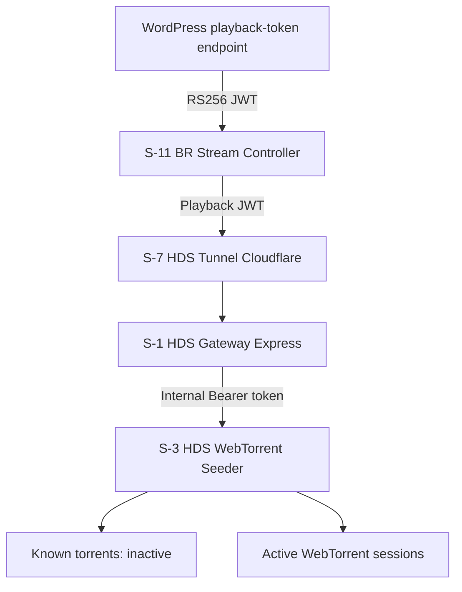

# SoNexus Project Architecture

Version: 1.5
Status: Final
Progress: Completed
Owner: SoNexus Project
Source of Truth: GitHub

Implementation baseline note: Gateway, Dashboard, WebTorrent Seeder, IPFS and PostgreSQL source configuration is published. The HDS Docker network migration was verified on 2026-08-07. ADR-005 Command Layer architecture is `v1.0 Final`; its API remains unimplemented.

## Purpose

This document defines the approved technical architecture of SoNexus: system layers, service boundaries, component communication, playback flow and architectural principles.

## System Overview

SoNexus is a modular decentralized high-quality audio streaming platform.

Playback starts through S-2 HDS IPFS Source Kubo for low startup latency and continues through browser-to-browser WebTorrent delivery supported by S-3 HDS WebTorrent Seeder when HDS bootstrap or recovery support is required.

## Architecture Goals

- High audio quality
- Modularity
- Scalability
- Decentralization
- Simplicity
- Maintainability
- Long-term evolution

## Architecture Layers

### Presentation

- WordPress and the server-side playback-token endpoint
- Musicon Theme
- Plyr / HTML5 playback UI

### Browser Runtime

- S-11 BR Stream Controller
- S-11.1 BR Universal URL Parser
- S-11.4 Quality Manager

### Protected HDS Coordination

- S-7 HDS Tunnel Cloudflare
- S-1 HDS Gateway Express
- S-8 HDS Dashboard Netdata

### Delivery

- S-2 HDS IPFS Source Kubo
- S-3 HDS WebTorrent Seeder

### Storage and Metadata

- S-4 HDS Storage ZFS
- S-5 HDS Metadata PostgreSQL
- S-6 HDS Transcoder FFmpeg
- Audio files
- Metadata

### Infrastructure

- Ubuntu Linux
- Docker
- Docker Compose
- Nginx
- Cloudflare Tunnel

## Service Registry

### Active services

- S-1 HDS Gateway Express
- S-2 HDS IPFS Source Kubo
- S-3 HDS WebTorrent Seeder
- S-4 HDS Storage ZFS
- S-5 HDS Metadata PostgreSQL
- S-6 HDS Transcoder FFmpeg
- S-7 HDS Tunnel Cloudflare
- S-8 HDS Dashboard Netdata
- S-11 BR Stream Controller

Service boundaries and current service status are documented in `../Services/`.

## High-Level Architecture

```text
WordPress / Musicon
   ↓
Plyr / HTML5 UI
   ↓
S-11 BR Stream Controller
   ↓
Protected infrastructure boundary
   ↓
S-7 HDS Tunnel Cloudflare
   ↓
S-1 HDS Gateway Express
   ├── S-5 HDS Metadata PostgreSQL
   ├── S-2 HDS IPFS Source Kubo
   ├── S-3 HDS WebTorrent Seeder
   └── S-8 HDS Dashboard Netdata
```

## HDS Docker Network Topology

```text
S-1 HDS Gateway Express
   ├── docker-network-ipfs ─────── S-2 HDS IPFS Source Kubo
   ├── docker-network-webtorrent ── S-3 HDS WebTorrent Seeder
   └── docker-network-postgresql ── S-5 HDS Metadata PostgreSQL
```

Each application network exists only for a verified service relationship. IPFS, WebTorrent Seeder and PostgreSQL do not share a direct Docker network with each other. Portainer is excluded from the HDS application networks.

## Component Responsibilities

### WordPress playback-token endpoint

- Exposes `POST /wp-json/sonexus/v1/playback-token`.
- Validates the requested `infoHash` against the authorized catalog.
- Issues and refreshes 30-minute playback JWTs using `RS256`.
- Keeps the RS256 private key exclusively on the WordPress server.
- Returns the token and its `expiresAt` value to S-11.

### Plyr / HTML5 playback UI

- Provides the third-party playback interface inside WordPress and Musicon.
- Renders playback controls and browser media state.
- Does not define SoNexus service identity.

### S-11 BR Stream Controller

- Controls browser-side transport behavior.
- Parses the universal stream URL.
- Resolves the track index.
- Coordinates quality selection.
- Starts playback through IPFS WebSeed.
- Connects browser-to-browser WebTorrent/WebRTC delivery.
- Integrates with the Service Worker where required.
- Manages Bit-Perfect capability signaling.
- Requests activation for the album `infoHash` when playback starts or resumes.
- Sends an activation heartbeat every five minutes while playback remains active.
- Stores the short-lived playback token only in browser memory.

### S-1 HDS Gateway Express

- Coordinates protected HDS application logic.
- Requests metadata through the private HDS service boundary.
- Coordinates protected integrations with the HDS IPFS and WebTorrent services.
- Integrates with HDS metadata and dashboard services.
- Does not stream audio directly.
- Does not carry browser P2P audio traffic.
- Authenticates and rate-limits client-facing Command Layer requests.
- Normalizes Command Layer errors and delegates torrent lifecycle operations to S-3.

### S-2 HDS IPFS Source Kubo

- Provides the initial playback source as WebSeed.
- Supports fast startup and initial buffering.

### S-3 HDS WebTorrent Seeder

- Provides HDS bootstrap and recovery seeding support through WebTorrent.
- Supports browser-side peer establishment when HDS assistance is required.
- Reduces dependence on permanent centralized delivery.
- Owns the known torrent catalog and active WebTorrent session state.
- Starts a known torrent on demand and removes its session after the idle timeout.

## Gateway Command Layer



Client-facing Gateway routes:

- `POST /api/v1/torrents/{infoHash}/activate`
- `GET /api/v1/torrents/{infoHash}`

Internal Seeder routes:

- `POST /internal/v1/torrents/{infoHash}/activate`
- `GET /internal/v1/torrents/{infoHash}`

Activation is idempotent. The default heartbeat interval is five minutes and the default Seeder idle timeout is 15 minutes. There is no public `stop` command; Seeder performs automatic cleanup.

Gateway does not accept arbitrary magnet URIs, file paths or media URLs. Command Layer runtime state belongs to Seeder and is not persisted in PostgreSQL.

Client-facing routes require a short-lived `RS256` playback JWT issued by `POST /wp-json/sonexus/v1/playback-token`. The private key remains only in WordPress; Gateway verifies with the public key. The single MVP scope `torrent:control` authorizes both activation and status for the token-bound `infoHash`. Internal Seeder routes require a separate shared Bearer token and are available only through `docker-network-webtorrent`.

The complete contract is defined by `../ADR/ADR-005-Gateway-Architecture.md`.

### S-5 HDS Metadata PostgreSQL

- Stores structured metadata and service relationships.

### S-4 HDS Storage ZFS

- Stores source audio, generated quality variants, covers and service data.

### S-6 HDS Transcoder FFmpeg

- Produces approved audio variants from source material.

## Playback Pipeline

```text
User
  ↓
WordPress / Musicon
  ↓
Plyr / HTML5 UI
  ↓
S-11 BR Stream Controller
  ├── S-1 HDS Gateway Express coordination and metadata
  ├── S-2 HDS IPFS Source Kubo fast start
  └── S-3 HDS WebTorrent Seeder bootstrap support
  ↓
Audio output
```

The transition from IPFS to WebTorrent must be seamless and transparent to the listener.

## Universal Media URL

```text
https://<gateway>/<TrackCID>#h=<AlbumInfoHash>&t=<TrackIndex>&q=<Quality>
```

Parameters:

- `TrackCID` — IPFS CID used for initial playback.
- `h` — WebTorrent album infoHash.
- `t` — track index inside the album.
- `q` — quality index.

Quality model:

- `q=0` — Auto
- `q=1` — AAC 320 kbps / Lossy
- `q=2` — FLAC 16-bit / 44.1–48 kHz / Lossless default
- `q=3` — FLAC 24-bit / Hi-Res

The fragment `#h=...&t=...&q=...` remains in BR and is not transmitted to the HTTP gateway. The public media URL does not use action endpoints such as `/s` or `/d`.

The universal media URL and the separate S-1 Command API are different contracts. After parsing the media URL, S-11 BR Stream Controller may send a dedicated control request to S-1 HDS Gateway Express to activate S-3 HDS WebTorrent Seeder.

The URL contract is defined by `../ADR/ADR-004-Universal-URL-Standard.md`.

## Metadata Flow

```text
S-11 BR Stream Controller
  ↓
Protected infrastructure boundary
  ↓
S-7 HDS Tunnel Cloudflare
  ↓
S-1 HDS Gateway Express
  ↓
S-5 HDS Metadata PostgreSQL
  ↓
Metadata response
  ↓
S-11 BR Stream Controller
```

## Audio Delivery Strategy

### Stage 1 — IPFS

Purpose:

- low startup latency;
- immediate playback;
- stable initial buffering;
- initial WebSeed source.

### Stage 2 — WebTorrent

Purpose:

- browser-to-browser peer-to-peer distribution through WebRTC;
- reduced server load;
- horizontal scalability;
- decentralized delivery.

## Deployment Areas

### HDS

Contains code, configuration and tools for the home development server:

- HDS Gateway Express
- HDS IPFS Source Kubo
- HDS WebTorrent Seeder
- HDS Storage ZFS
- HDS Metadata PostgreSQL
- HDS Transcoder FFmpeg
- HDS Tunnel Cloudflare
- HDS Dashboard Netdata
- Docker
- Tools

### VPS

Contains code, configuration and tools for the VPS environment:

- WordPress
- Nginx
- Cloudflare
- Docker
- Tools

## Technology Stack

### Presentation Stack

- WordPress
- Musicon Theme
- Plyr
- JavaScript
- HTML5
- CSS3

### Service Stack

- Node.js
- Express.js
- WebTorrent
- IPFS / Kubo
- PostgreSQL
- FFmpeg
- Netdata

### Infrastructure

- Ubuntu Linux
- Docker
- Docker Compose
- Nginx
- Cloudflare Tunnel
- ZFS

## Scalability

The architecture allows future horizontal scaling through:

- multiple HDS Gateway Express instances where required;
- multiple WebTorrent seeding nodes;
- multiple IPFS source nodes;
- distributed metadata;
- load balancing;
- multi-region deployment.

## Architecture Principles

- Architecture First
- API First
- Modular Design
- Stateless Services where applicable
- P2P First
- IPFS Fast Start
- WebTorrent Primary Delivery
- Separation of Concerns
- GitHub stores approved architecture and published engineering documentation
- Trello is the active workflow and pre-publication iteration space

### Decentralized Delivery Principle

The primary source of audio delivery in SoNexus is the browsers of users participating in the network.

The Home Data Server (HDS) is not a permanent content delivery server.

HDS is used only for:

- bootstrap seeding;
- backup seeding;
- network recovery.

After playback starts and browser peers become available, content delivery should progressively migrate from HDS to browser-to-browser peer-to-peer delivery using WebTorrent/WebRTC.

All SoNexus services shall be designed to minimize HDS traffic and maximize decentralized peer-to-peer delivery.

S-1 HDS Gateway Express and the related HDS services must not turn HDS into a permanent streaming server or centralized CDN.

## Related ADRs

- `../ADR/ADR-000-Status.md`
- `../ADR/ADR-001-WebTorrent.md`
- `../ADR/ADR-002-IPFS-as-WebSeed.md`
- `../ADR/ADR-003-Docker-Platform.md`
- `../ADR/ADR-004-Universal-URL-Standard.md`
- `../ADR/ADR-005-Gateway-Architecture.md`
- `../ADR/ADR-010-Engineering-Methodology.md`

## Related Documents

- `../../README.md`
- `Project-Status.md`
- `Project-Methodology.md`
- `../Services/`

## Final Rule

All implementation must remain consistent with this document and approved ADRs. Architectural changes require explicit approval and an ADR update or a new ADR.
